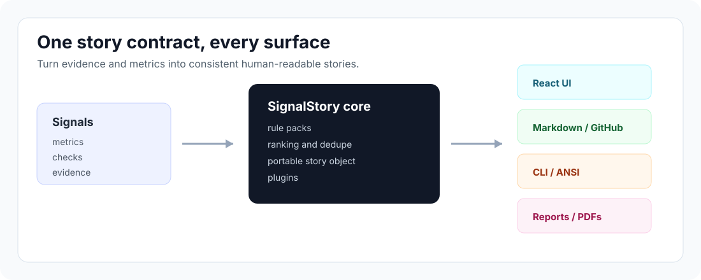
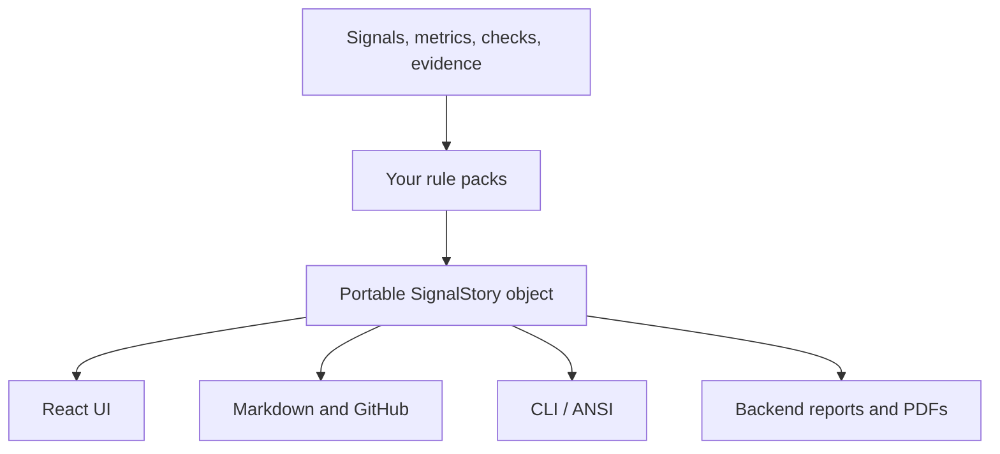
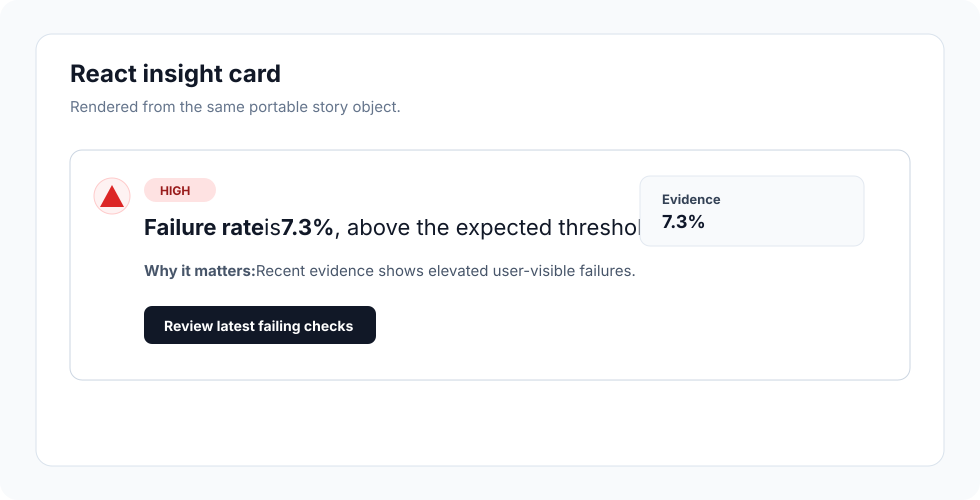
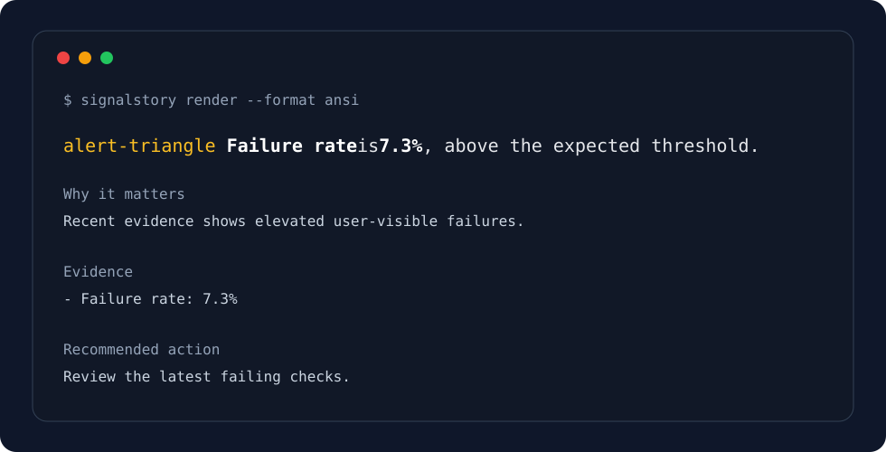
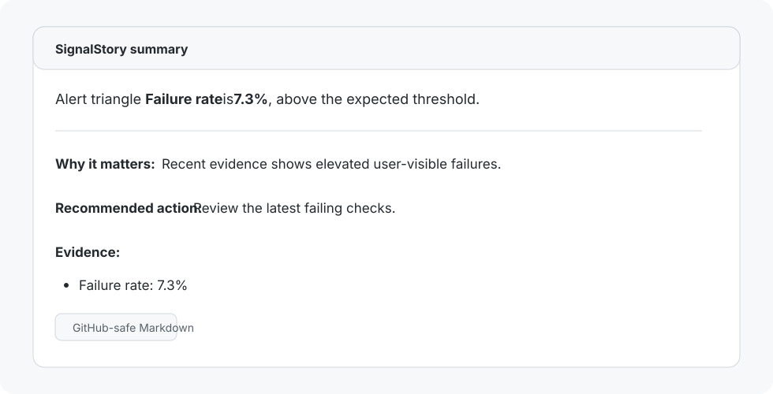
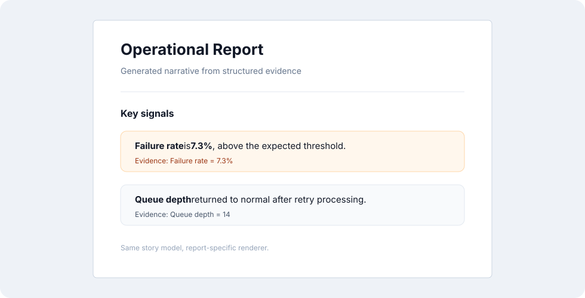

# SignalStory

[](https://github.com/ganakailabs/signalstory/releases/tag/v0.1.0)
[](https://www.apache.org/licenses/LICENSE-2.0)


**Turn structured signals into evidence-backed stories** for **React**,
**Markdown**, **CLI output**, **GitHub comments**, **backend reports**, and
**AI/agent workflows**.

> **One signal should not become five different explanations.**
> SignalStory gives your product one shared story contract and lets every
> surface render it in its own native format.

SignalStory is a small, renderer-neutral story engine. You give it facts,
metrics, findings, scores, checks, or evidence. It applies your rule packs and
returns a portable story object that can be rendered consistently across every
surface where your product explains what happened, why it matters, and what to
do next.

`signals` -> `rule packs` -> `portable stories` -> `React | Markdown | CLI | reports`



## The Problem

Most products eventually need to **explain signals to humans**:

- **Dashboard:** a short insight with bold emphasis and an icon.
- **PDF/report:** the same message with evidence and rationale.
- **CLI:** terminal-safe text with ANSI styling.
- **GitHub:** Markdown that is readable in pull requests.
- **Backend/agent:** structured text that can be tested and traced.

Without a shared story layer, those surfaces drift. Each one starts to own its
own prose rules, severity ordering, dedupe behavior, icon mapping, evidence
formatting, and "why it matters" copy. Over time, the same signal is explained
slightly differently in every place.

> **SignalStory fixes this by separating story generation from story
> rendering.** Your rule pack decides the message. Each renderer decides how it
> should look.



## What SignalStory Gives You


- **Rules:** one place to define when a story should appear.
- **Contract:** one object for sentence, rationale, severity, priority,
  confidence, action, icon, and evidence.
- **Ranking:** deterministic ordering and dedupe across generated stories.
- **Renderers:** Markdown, ANSI, React, and Python runtime paths.
- **Rich text:** bold/code marks and links without binding generation logic to
  one UI.
- **Extensions:** plugin hooks for enrichment, filtering, localization,
  telemetry, or optional AI rewrite steps.
- **Domain neutral:** you bring the vocabulary, rules, icons, and tone.

## Screenshots

These examples all come from the same kind of story contract. Only the renderer
changes.

### React

**Product UI** can show concise insight cards with icons, severity, rationale,
evidence, and actions.



### CLI

**Terminal output** can keep the same wording while using ANSI emphasis and
shell-friendly formatting.



### Markdown / GitHub

**Markdown output** can be pasted into GitHub comments, issue summaries, release
notes, or review workflows.



### Backend Report / PDF

**Backend report generation** can use the Python runtime to keep PDFs and
scheduled reports aligned with the rest of the product.



## Install

SignalStory is currently distributed from this **public GitHub repository**.

**JavaScript and TypeScript**

```bash
npm install https://github.com/ganakailabs/signalstory/archive/refs/tags/v0.1.0.tar.gz
```

**Python**

```bash
pip install "signalstory @ git+https://github.com/ganakailabs/signalstory.git@v0.1.0#subdirectory=python"
```

> npm and PyPI publication are planned for a future release. Until then,
> **pin to a release tag** instead of a branch.

## Quick Start

```js
import { createSignalStoryEngine } from "signalstory/core";
import { renderStoryMarkdown } from "signalstory/markdown";
import { renderStoryAnsi } from "signalstory/ansi";

const rulePack = {
  id: "quality-signals",
  rules: [
    {
      id: "high-failure-rate",
      when: { signal: "failureRate", gt: 0.05 },
      story: {
        id: "high-failure-rate",
        severity: "high",
        icon: "alert-triangle",
        priority: 90,
        sentence: [
          { text: "Failure rate", marks: ["bold"] },
          { text: " is " },
          { path: "failureRateLabel", marks: ["bold"] },
          { text: ", above the expected threshold." },
        ],
        rationale: [
          { text: "Recent evidence shows elevated user-visible failures." },
        ],
        action: { label: "Review the latest failing checks." },
        evidence: [{ label: "Failure rate", path: "failureRateLabel" }],
      },
    },
  ],
};

const engine = createSignalStoryEngine({ rulePacks: [rulePack] });

const stories = engine.generate({
  signals: {
    failureRate: 0.073,
    failureRateLabel: "7.3%",
  },
});

console.log(renderStoryMarkdown(stories[0]));
console.log(renderStoryAnsi(stories[0], { color: false }));
```

Expected Markdown:

```md
alert-triangle **Failure rate** is **7.3%**, above the expected threshold.

**Why it matters:** Recent evidence shows elevated user-visible failures.

**Recommended action:** Review the latest failing checks.

**Evidence:**
- Failure rate: 7.3%
```

Expected terminal output:

```text
alert-triangle Failure rate is 7.3%, above the expected threshold.
```

In a terminal, `Failure rate` and `7.3%` are rendered with ANSI bold styling.

## Python Quick Start

```python
from signalstory import SignalStoryEngine, render_plain_text

engine = SignalStoryEngine(rule_packs=[{
    "id": "quality-signals",
    "rules": [{
        "id": "high-failure-rate",
        "when": {"signal": "failureRate", "gt": 0.05},
        "story": {
            "id": "high-failure-rate",
            "severity": "high",
            "icon": "alert-triangle",
            "priority": 90,
            "sentence": [
                {"text": "Failure rate", "marks": ["bold"]},
                {"text": " is "},
                {"path": "failureRateLabel", "marks": ["bold"]},
                {"text": ", above the expected threshold."},
            ],
            "evidence": [{"label": "Failure rate", "path": "failureRateLabel"}],
        },
    }],
}])

stories = engine.generate({
    "signals": {
        "failureRate": 0.073,
        "failureRateLabel": "7.3%",
    }
})

print(render_plain_text(stories[0]["sentence"]))
```

Expected output:

```text
Failure rate is 7.3%, above the expected threshold.
```

## Story Model

A generated story is a **portable object**:

```json
{
  "id": "high-failure-rate",
  "key": "high-failure-rate",
  "ruleId": "high-failure-rate",
  "rulePackId": "quality-signals",
  "severity": "high",
  "priority": 90,
  "confidence": 1,
  "tone": "neutral",
  "icon": "alert-triangle",
  "sentence": [
    { "text": "Failure rate", "marks": ["bold"] },
    { "text": " is " },
    { "text": "7.3%", "marks": ["bold"] },
    { "text": ", above the expected threshold." }
  ],
  "rationale": [
    { "text": "Recent evidence shows elevated user-visible failures." }
  ],
  "action": { "label": "Review the latest failing checks." },
  "evidenceRefs": [
    { "label": "Failure rate", "path": "failureRateLabel", "value": "7.3%" }
  ],
  "metadata": {}
}
```

The contract is intentionally small:

- **`sentence`:** primary user-facing text.
- **`rationale`:** why the signal matters.
- **`action`:** the recommended next step.
- **`severity`, `priority`, `confidence`:** ranking and dedupe inputs.
- **`icon`:** a symbolic name; your renderer decides what it looks like.
- **`evidenceRefs`:** traceability back to source facts.
- **`metadata`:** host-specific context.

## Where It Fits

SignalStory is useful when the **same evidence needs to appear in multiple
places**:

- **Product dashboards** and health pages.
- **Executive or operational reports**.
- **CLI review, scan, or audit output**.
- **GitHub pull request comments**.
- **Agent summaries** and deterministic evidence blocks.
- **Monitoring, quality, security, finance, sales, support, compliance**, or
  workflow automation tools.

> SignalStory is **not an LLM framework**. It is the deterministic layer that
> can sit before or after AI systems when you need stable, testable,
> evidence-grounded text.

## Packages

This repository currently contains:

- **`signalstory/core`:** JavaScript rule engine, story contract, ranking, dedupe,
  and plugin hooks.
- **`signalstory/markdown`:** Markdown and GitHub-safe renderers.
- **`signalstory/ansi`:** plain text and ANSI terminal renderers.
- **`signalstory/react`:** React render helpers.
- **`signalstory` for Python:** backend/report runtime.
- **`schemas/story.schema.json`:** portable story schema.

## Plugins

Plugins can transform generated stories after deterministic rule evaluation.

```js
const addMetadata = {
  afterGenerate(stories, context) {
    return stories.map((story) => ({
      ...story,
      metadata: {
        ...story.metadata,
        generatedFor: context.metadata?.surface,
      },
    }));
  },
};

const engine = createSignalStoryEngine({
  rulePacks: [rulePack],
  plugins: [addMetadata],
});
```

Use plugins for **host-specific enrichment**, **filtering**, **localization**,
**telemetry**, or **AI rewrite steps**. Keep the base rule output deterministic
when you need repeatable reports or tests.

## Design Principles

- **Evidence first:** generated stories should point back to the facts that caused
  them.
- **Renderer neutral:** the core story object should work across products, reports,
  terminals, pull requests, and agents.
- **Host controlled:** applications own vocabulary, icons, severity meanings, and
  tone.
- **Deterministic by default:** AI-assisted rewrites should be optional and
  explicit.
- **Portable contracts:** JavaScript and Python should share the same story shape.

## Development

```bash
npm install
npm test
```

The test suite covers core rule generation, dedupe/ranking, plugin hooks,
Markdown rendering, and ANSI rendering.

## Status

SignalStory is **public** and usable as a tagged GitHub dependency. The current
release is **`v0.1.0`**.

The API is still early. **Pin to release tags**, review changes before
upgrading, and treat npm/PyPI package publication as future work.

## License

Apache-2.0
