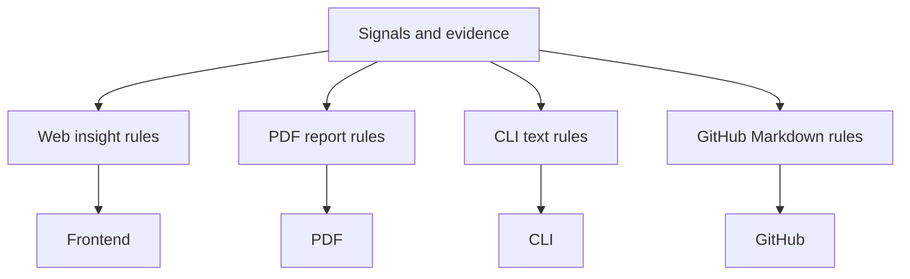
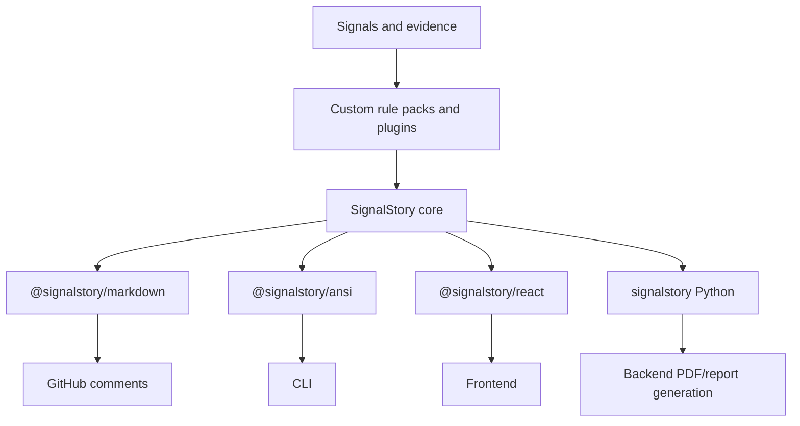

# SignalStory

SignalStory turns structured signals and evidence into portable, renderable
stories for products, reports, CLIs, pull requests, and agent workflows.

The library is intentionally domain-neutral. Host applications provide rule
packs, icon registries, render themes, and optional AI rewrite hooks.

## Architecture

Before extraction, applications often duplicate prose, severity, ranking, and
formatting logic per surface:

With SignalStory, rule evaluation and story construction are shared. Each
surface only renders a shared story contract:

## Packages

- `@signalstory/core`: rule engine, story contract, ranking, dedupe, plugins.
- `@signalstory/markdown`: Markdown and GitHub rendering.
- `@signalstory/ansi`: plain text and ANSI terminal rendering.
- `@signalstory/react`: React rich text rendering.
- `signalstory`: Python runtime for backend use.

## Current Status

This repository is an implementation scaffold with working JS core, Markdown,
ANSI, and Python runtimes. It is not published yet.

