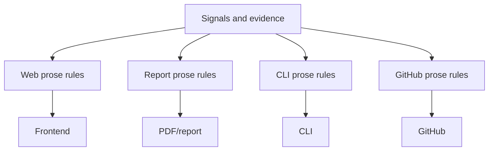
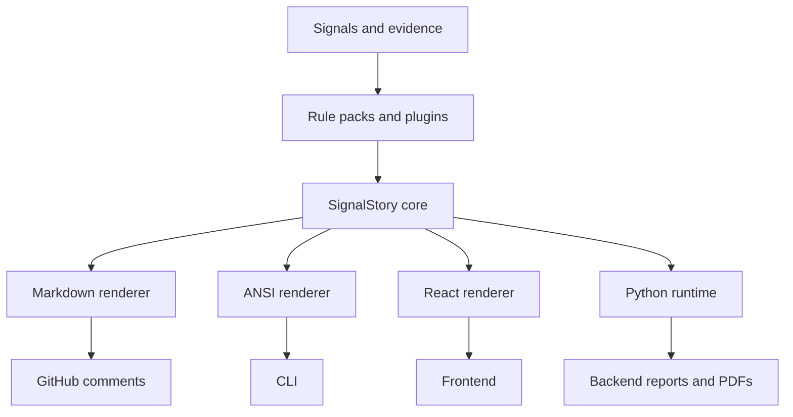

# SignalStory

SignalStory turns structured signals and evidence into concise, human-readable
stories that can be rendered consistently in web apps, PDFs, CLIs, GitHub
comments, and agent workflows.

It is designed for product and engineering teams that already have facts,
metrics, findings, checks, or evidence, and want one shared way to turn those
signals into useful narrative text without rewriting the same prose logic in
every surface.

## What It Does

- Generates ranked stories from structured signals and evidence.
- Keeps wording, severity, priority, rationale, actions, and evidence references
  in one reusable rule contract.
- Renders the same story contract as plain text, Markdown, ANSI terminal output,
  React elements, or Python dictionaries for backend/report workflows.
- Supports bold/code marks, icons, severity, confidence, and evidence links.
- Allows host applications to provide domain-specific rule packs, render themes,
  icon registries, and plugins.

SignalStory is domain-neutral. It does not ship with a cloud, security,
finance, sales, or operations opinion. Your application owns the signals,
rules, copy, icons, and rendering style.

## Install

SignalStory is currently distributed from this public GitHub repository.

JavaScript and TypeScript:

```bash
npm install https://github.com/ganakailabs/signalstory/archive/refs/tags/v0.1.0.tar.gz
```

Python:

```bash
pip install "signalstory @ git+https://github.com/ganakailabs/signalstory.git@v0.1.0#subdirectory=python"
```

npm and PyPI publication are planned for a future release. Until then, pin to a
release tag instead of a branch.

## Quick Start

```js
import { createSignalStoryEngine } from "signalstory/core";
import { renderStoryMarkdown } from "signalstory/markdown";
import { renderStoryAnsi } from "signalstory/ansi";

const rulePack = {
  id: "quality-signals",
  rules: [
    {
      id: "high-failure-rate",
      when: { signal: "failureRate", gt: 0.05 },
      story: {
        id: "high-failure-rate",
        severity: "high",
        icon: "alert-triangle",
        priority: 90,
        sentence: [
          { text: "Failure rate", marks: ["bold"] },
          { text: " is " },
          { path: "failureRateLabel", marks: ["bold"] },
          { text: ", above the expected threshold." },
        ],
        rationale: [
          { text: "Recent evidence shows elevated user-visible failures." },
        ],
        action: { label: "Review the latest failing checks." },
        evidence: [{ label: "Failure rate", path: "failureRateLabel" }],
      },
    },
  ],
};

const engine = createSignalStoryEngine({ rulePacks: [rulePack] });

const stories = engine.generate({
  signals: {
    failureRate: 0.073,
    failureRateLabel: "7.3%",
  },
});

console.log(renderStoryMarkdown(stories[0]));
console.log(renderStoryAnsi(stories[0], { color: false }));
```

Python:

```python
from signalstory import SignalStoryEngine, render_plain_text

engine = SignalStoryEngine(rule_packs=[{
    "id": "quality-signals",
    "rules": [{
        "id": "high-failure-rate",
        "when": {"signal": "failureRate", "gt": 0.05},
        "story": {
            "id": "high-failure-rate",
            "severity": "high",
            "icon": "alert-triangle",
            "priority": 90,
            "sentence": [
                {"text": "Failure rate", "marks": ["bold"]},
                {"text": " is "},
                {"path": "failureRateLabel", "marks": ["bold"]},
                {"text": ", above the expected threshold."},
            ],
            "evidence": [{"label": "Failure rate", "path": "failureRateLabel"}],
        },
    }],
}])

stories = engine.generate({
    "signals": {
        "failureRate": 0.073,
        "failureRateLabel": "7.3%",
    }
})

print(render_plain_text(stories[0]["sentence"]))
```

## Story Model

A generated story is a portable object:

```json
{
  "id": "high-failure-rate",
  "key": "high-failure-rate",
  "ruleId": "high-failure-rate",
  "rulePackId": "quality-signals",
  "severity": "high",
  "priority": 90,
  "confidence": 1,
  "tone": "neutral",
  "icon": "alert-triangle",
  "sentence": [
    { "text": "Failure rate", "marks": ["bold"] },
    { "text": " is " },
    { "text": "7.3%", "marks": ["bold"] },
    { "text": ", above the expected threshold." }
  ],
  "rationale": [],
  "action": null,
  "evidenceRefs": [
    { "label": "Failure rate", "path": "failureRateLabel", "value": "7.3%" }
  ],
  "metadata": {}
}
```

The contract is intentionally small:

- `sentence` is the primary user-facing text.
- `rationale` explains why the signal matters.
- `action` can point to the next step.
- `evidenceRefs` keeps generated prose traceable to inputs.
- `metadata` lets host applications carry application-specific context.

## Architecture

Without a shared story layer, applications often duplicate prose, severity,
ranking, and formatting logic per surface:



With SignalStory, rule evaluation and story construction are shared. Each
surface renders the same story contract:



## Packages

This repository currently contains:

- `signalstory/core`: JavaScript rule engine, story contract, ranking, dedupe,
  and plugin hooks.
- `signalstory/markdown`: Markdown and GitHub-safe renderers.
- `signalstory/ansi`: plain text and ANSI terminal renderers.
- `signalstory/react`: React render helpers.
- `signalstory` for Python: backend/report runtime.
- `schemas/story.schema.json`: portable story schema.

## Plugins

Plugins can transform generated stories after deterministic rule evaluation.

```js
const addMetadata = {
  afterGenerate(stories, context) {
    return stories.map((story) => ({
      ...story,
      metadata: {
        ...story.metadata,
        generatedFor: context.metadata?.surface,
      },
    }));
  },
};

const engine = createSignalStoryEngine({
  rulePacks: [rulePack],
  plugins: [addMetadata],
});
```

Use plugins for host-specific enrichment, filtering, localization, telemetry,
or AI rewrite steps. Keep the base rule output deterministic when you need
repeatable reports or tests.

## Design Principles

- Evidence first: generated stories should point back to the facts that caused
  them.
- Renderer neutral: the core story object should work across products, reports,
  terminals, pull requests, and agents.
- Host controlled: applications own vocabulary, icons, severity meanings, and
  tone.
- Deterministic by default: AI-assisted rewrites should be optional and
  explicit.
- Portable contracts: JavaScript and Python should share the same story shape.

## Development

```bash
npm install
npm test
```

The test suite covers core rule generation, dedupe/ranking, plugin hooks,
Markdown rendering, and ANSI rendering.

## Status

SignalStory is public and usable as a tagged GitHub dependency. The current
release is `v0.1.0`.

The API is still early. Pin to release tags, review changes before upgrading,
and treat npm/PyPI package publication as future work.

## License

Apache-2.0
